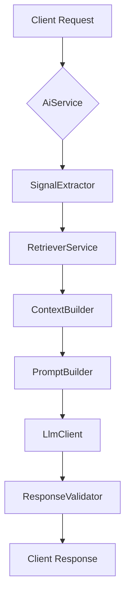
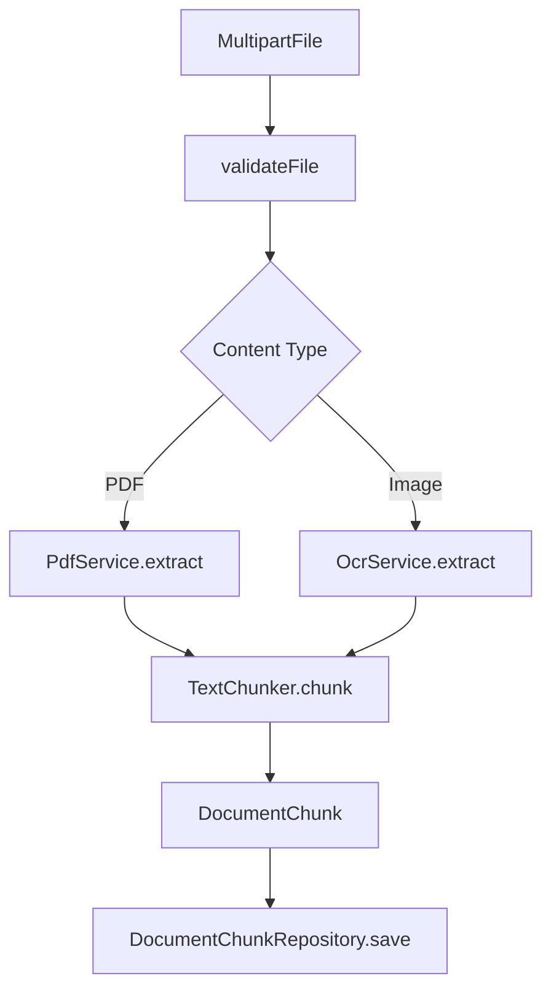
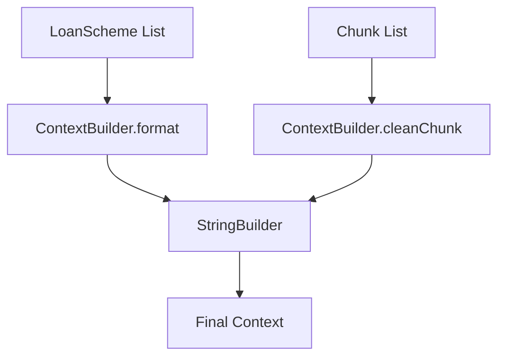

# AI Banking Agent Technical Documentation

## Overview

AI Banking Agent is a Spring Boot RAG-based conversational service that answers banking queries using loan scheme data and user-uploaded documents (PDF/images). It extracts intent signals, retrieves relevant context via vector chunks, augments prompts with loan metadata, calls an LLM, and validates responses before returning them to the user.

## Pre-Conditions

- Spring Boot 3.5.13 + Java 17 runtime
- H2 database configured for `DocumentChunk` persistence
- External LLM client reachable via `LlmClient`
- PDF and image files ≤ 5 MB
- Loan schemes pre-loaded in `LoanScheme` repository

## Core Workflow

1. User sends text message or uploads file + message
2. `SignalExtractorService` parses message into `QuerySignal`
3. `RetrieverService` fetches matching `LoanScheme` entities
4. For files: OCR/PDF extraction → `TextChunker` → `DocumentChunk` saved
5. `PdfRetriever` pulls relevant chunks using signal + keywords
6. `ContextBuilder` assembles loan and document context
7. `PromptBuilder` creates final LLM prompt
8. `LlmClient` calls model; `ResponseValidatorService` sanitizes output

## Validation Chain

| Step | Component | Checks Performed |
|------|-----------|------------------|
| 1 | File Upload | Size ≤ 5 MB, supported MIME type |
| 2 | Signal Extraction | Intent classification, loan flag |
| 3 | Retrieval | Non-empty loan list or chunk results |
| 4 | LLM Response | Non-null, non-empty, no fallback trigger |
| 5 | Final Output | Sanitized string returned to caller |

## Save Path – Entity

```
User File → PdfService/OcrService → TextChunker → DocumentChunk
  → DocumentChunkRepository.save() → H2 DB
```

`DocumentChunk` stores: `content`, `source` (filename), `type` (MIME).

## Final State Summary

- Successful path: validated LLM string returned
- Fallback path: "Service is temporarily unavailable..."
- File chunks persisted for future retrieval
- Loan context always appended when matches exist

## Key Differences (Text vs File Flow)

| Aspect | generateResponse (text) | processFile (upload) |
|--------|--------------------------|----------------------|
| Input | Plain message | MultipartFile + message |
| Extraction | None | PDF OCR or image OCR |
| Chunking | Empty list | TextChunker on extracted text |
| Persistence | None | DocumentChunk rows saved |
| Context Sources | Loan + empty chunks | Loan + saved chunks |

## Key Classes & Repositories

- `AiServiceImpl` – orchestration entry point
- `SignalExtractorServiceImpl` – intent parsing
- `RetrieverServiceImpl` – loan retrieval
- `ContextBuilderServiceImpl` – context assembly
- `PromptBuilderServiceImpl` – prompt construction
- `LlmClientServiceImpl` – LLM invocation
- `ResponseValidatorServiceImpl` – output sanitization
- `DocumentChunkRepository` – chunk persistence
- `LoanSchemeRepository` – loan metadata

## Diagrams

### End-to-End Request Flow


### File Processing & Persistence


### Context Assembly

